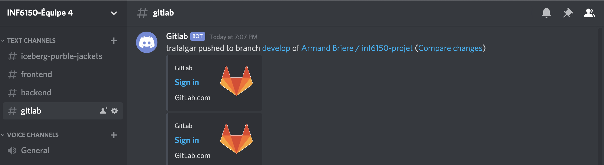

# Sommaire

Le but de faire une planification et analyse de projet est de clarifier le but de ce qui est à faire pour qu'on aille une vision plus globale de ce qui doit être produit à la fin et comment le projet devrait se dérouler, c'est-à-dire les tâches qui seront à faire à chaque sprint, les livrables après chaque sprint auront l'air de quoi. En rassemblant tout ces informations, ça nour permettra également d'identifier des risques potentiels qui pourrait se produire. Dans ce document, il sera présenté la planification stratégique, donc l'objectif du projet avec les détails et ce qui va permettre de réussir le projet. La planification tactique contiendra les responsabilités des personnes dans l'équipe, les outils qui sont vont être utilisé pour le projet, les risques, comment le tout va être développer. Et finalement la planification opérationnelle, qui sont les sprints avec une brève description et les tâches qui devront être fait.

# Planification stratégique

## Description détaillée

L'objectif du projet est qu'en tant qu'usager nous soyons capable de retrouver les informations que nous voulons concernant un jeu de société, à partir du site web. C'est-à-dire que le site web doit être "friendly-user" pour que tout type de clientèle soit capable de retrouver les informations qu'ils ont besoin. Pour ce faire tout ce qui est nécessaire est d'avoir accès à la base de données qui va contenir les informations des jeux de société. Par la suite, le reste est de faire une interface qui est "friendly-user" pour que tout les usagers soient capabable de navigué sur le site web sans être perdu, qu'ils soient en mesure de trouver les options les plus utilisés, l'option aide s'ils ont de la misère à se retrouver, etc.

## Critères de succès

Les critères qui vont faire en sorte que le projet soit un succès est un bon travail d'équipe, définir clairement ce qui doit être fait et les buts à atteindre à la fin de chaque sprint, compréhension des technologies utilisées, comprendre la base de données, comment elle est structurée et comment l'utilisé pour accéder aux informations nécessaires, la communication entre les personnes qui travail sur le projet, etc.

# Planification tactique

Equipe 04 : Iceberg Purple Jackets.

## Listes des rôles

Voici la liste des rôles de chaque membre de l'équipe :

| Membre | Rôle |
| :--- | :--- |
| Armand Brière | Responsable infrastructure et remise |
| Félix Côté | Responsable Frontend |
| Yassine Hasnaoui | Responsable Backend |
| Joaquin Lee Martinez | Responsable Frontend |
| Charles Thérien | Responsable Backend et remise |

## Partages des responsabilités

Armand Brière : Product Owner et responsable infrastructure. Armand va avoir la responsabilité de vérifier que le livrable est ce qui as été décrit dans la charte de projet. En plus de s'assurer de la qualité des livrables lors des sprints, Armand va aussi être en charge de la mise en place d'un environnement de développement uniforme ainsi que l'intégration du FrontEnd avec le BackEnd.
 
Charles Thérien : Scrum Master et responsable BackEnd. Charles va avoir la responsabilité de s’assurer que les membres de l’équipe vont avoir accès à tout ce qu’ils ont besoin pour travailler, garder l’équipe sur le bon chemin lors des sprints et de s’assurer d’un bon déroulement de sprint. De plus, Charles va aider avec le développement du BackEnd lorsqu’il n’a aucune tâches de Scrum Master.

Joaquin Lee Martinez : Responsable FrontEnd. Joaquin va avoir la responsabilité comme développeur FrontEnd de s’assurer que l’application fonctionne du côté utilisateur. Il est en charge de l'affichage dynamique de l'application à partir des informations récupérer grâce à l'api. Plus spécifiquement, Joaquin va être responsable de l’esthétique de l’application. 

Félix Côté: Responsable FrontEnd. Félix va avoir la responsabilité comme développeur FrontEnd de s’assurer que l’application fonctionne du côté utilisateur. Il est en charge de l'affichage dynamique de l'application à partir des informations récupérer grâce à l'api. Plus spécifiquement, Félix va être responsable de gérer les informations partager entre le FrontEnd et le BackEnd et faire l’intégration de ces informations dans le FrontEnd.

Yassine Hasnaoui : Responsable BackEnd. Yassine va avoir la responsabilité comme développeur BackEnd de s’assurer du fonctionnement du côté serveur. Il est en charge de la gestion serveur de l'application afin d'offrir une api fonctionnelle et accessible du FrontEnd. Plus spécifiquement, il va faire les appels à la base de données et le traitement de calcul nécessaire pour le fonctionnement de l’application.

## Cycle de développement

Nous utilisons la méthode agile, donc notre cycle de développement va suivre un cycle basé sur des livraisons itératives. À chaque fin de sprint nous allons avoir un livrable prêt pour déploiement, à l'exception du sprint zéro. 

Premièrement on a la phase de Planification et Documentation avant que le projet commence pour vérifier sa faisabilité, s'assurer que tous les parties prenantes soient d’accord sur l’envergure du projet et définir le déroulement du projet.

Ensuite, nous avons les Sprints. Le cycle de vie d’un sprint se résume à :

- Exigences : Définir les exigences pour l’itération basé sur le carnet de backlog, Sprint backlog et les besoins du client.
- Développement : Développer l’application selon les taches choisi dans la phase d’exigences.
- Testage : Lors du Sprint, il faut incorporer les tests pour que le livrable soit déployable.
- Livraison : Intégrer et livrer l’itération de l’application en production.
- Rétrospective : Accepter les commentaires du client et les incorporer dans la prochaine itération.

## Outils utilisés

Voici une liste des outils que nous utilisons :

- Gitlab comme gestionnaire de source.
- Docker pour gérer les dépendances technologiques.
- Angular comme framework pour le FrontEnd.
- Flask comme framework pour le BackEnd.
- Discord comme outil de communication entre les membres de l'équipe.

## Eléments de coordinations

Notre Backlog est sur notre projet sur Gitlab, donc tout nos User Story sont sur Gitlab. De cette façon, tout le monde ont accès au Backlog de façon efficace sans avoir besoin de se rencontrer. 

De plus, nous utilisons Discord pour discuter du projet et coordonner nos tâches.

## Mode décisionnel

Le mode décisionnel au sein de l'équipe est un élément à planifier avant d'entamer la réalisation de notre projet, car la complexité des différentes technologies que nous utiliserons comme outils de développement demande une certaine précision dans les choix que l'équipe fera tout au long du processus.

### Principal

Les décisions jugées importantes dans ce projet sont essentiellement tout changement de direction majeur qui necessesite un plus haut niveau de précautions de la part des membres de l'équipe (tous), sois parce que'elles peuvent entraîner des risques non négligeables ou être une opportunité importante a saisir. Un consensus de la part de tous les membres de l'équipe est nécessaire à la validation d'une décision jugée importante. Si un ou plusieurs membres vont a l'encontre du jugement majoritaire, l'une des deux oppositions devra convaincre l'autre pour jusqu'à l'unanimité.

### Secondaire

Les décisions de plus bas niveaux représentent majoritairement celles qui ne demandent pas un consensus de l'équipe pour être approuvées. Nous comptons sur les compétences et l'autonomie des membres de notre équipe pour juger de l'impact qu'une décision individuelle (ou plusieurs membres de leurs côtés) peut avoir sur le projet ainsi que la nécessité d'en parler avec les membres concernés. Il s'agit en d'autres termes de décisions opérationnelles mineures.

## Résolution de conflits

Le travail en équipe nous offre de multiples occasions d’apprentissage et cela nécessite des habiletés précises, telles qu’exprimer ses idées, négocier, déléguer et interagir avec différents types de personnalité. L’expérience peut s’avérer stimulante et intéressante, mais peut aussi s'avérer être une source de tensions et de désaccords. 

Les conflits que nous  suspectons de se produire sont :

- Conflits reliés au fonctionnement de l’équipe.
- Conflits concernant la réalisation du travail.
- Conflits en raison de traits de personnalité incompatibles.

Nous avons décidé d'utiliser une approche par compromis dans nos résolutions de conflits. Âpres avoir précisé et chercher à comprendre la source du désaccord et en écoutant les différents points de vue des membres concerner, un compromis sera proposé par l'équipe dépendamment de la situation pour que tout le monde y trouve sa part.

## Risques

Cette section consiste à l'élaboration de méthodes préventives afin de minimiser les risques cernés dans la charte de projet. Ce processus comprend la détermination des solutions poprtentiels ainsi que de leurs répercussions potentielles sur l'avancement de notre projet. Les renseignements qui en découlent seront ensuite implantés dans les processus de gestion du projet.

Le risque que nous considérions avoir une probabilité assez enlevée est celui relié à l'expertise disponible dans chaque technologie spécifique (Front-End, Back-End et DevOps) que nous utilisons. La manière la plus efficace que nous avons établie pour diminuer le risque de ralentissement est l'entre-aide et la communication constante a l'aide de Discord (un logiciel de communication). Nous avons aussi pris le temps de discuter des forces et des faiblesses de chacun pour couvrir tous les champs du projet avec les meilleures compétences possibles.

Ensuite, afin de bien respecter les délais que nous devons respecter, nous utilisons une fonctionnalité interactive intégrer dans gitlab (backlog) afin d'organiser notre équipe en donnant la possibilité au membre de l'équipe de s'attribuer eux mèmes leurs taches tout en ayant une visibilité sur l'avancement global de l'élément a livré.

# Planification opérationnelle

## Sprint 00

Infrastructure

### Description

Ce sprint est une mise en place préventive de l'infrastructure complète et opérationnelle de l'application.
Ce sprint est extrêmement important en raison de la diversité des outils technologique de développement de l'équipe. Celle-ci est présente au niveau des systèmes d'exploitation, certains membres utilisent Windows, MacOS ou encore Linux.

Nous avons choisi la technologie Docker afin d'uniformiser la gestion de dépendances du projet et ainsi offrir un environnement de développement unique pour ce projet.

### Liste des tâches

- Création d'une application Angular dans un docker.
- Création d'une application Flask dans un docker.
- Connexion entre les deux dockers.
- Création d'un script de déploiement automatisé.
- Création d'un exemple d'intéraction entre Angular et Flask.
- Documentation.

## Sprint 01

Echange de données.

### Description

Le but de ce sprint est de permettre un échange de données complet et fonctionnel entre le Backend et le Frontend.
Il s'agit de l'initialisation de l'API Backend ainsi que l'interface de base du Frontend.

### Liste des tâches

- Connexion entre le Backend et la base de donnée.
    - Insertion.
    - Sélection.
    - Suppression.
    - Modification.
- Création d'une route API transférant l'entièreté des données.
- Création du layout Frontend de base.
    - Navbar.
    - Footer.
    - Palette de couleur.
- Affichage de la donnée brute sur la page d'accueil.

## Sprint 02

Minimum Viable Product.

### Description

Ce sprint constitue la dernière étape de développement de l'application. L'objectif est donc d'améliorer le design ainsi qu'optimiser le transfert de données afin de ne plus surcharger la page.

### Liste des tâches

- Ajout de route API Backend plus précise.
    - Route page d'accueil.
    - Route dynamique par jeu.
    - Route de recherche.
- Création d'un composant générique d'affichage Frontend d'un jeu.
- Création d'une barre de recherche Frontend.
- Affichage du "jeu du jour" sur la page d'accueil.

## Sprint 03

Paufinage.

### Liste des tâches

- Optimiser les appels à la base de données.
- Améliorer le design visuel de la page web.
- Identifier et valider les edges cases.

## Gestion des changements

La gestion des changements est une notion importante de notre projet car nous voulons pouvoir fournir un outil aussi proche que possible des différentes demandes du client.
Avant toute prise de décision nous voulons analyser la demande au complet afin de pouvoir établir un diagramme des répercussions que celle-ci pourrait engendrer.
Ensuite si le changement est approuvé par l'équipe nous allons repartir les différents besoins dans les tâches concernées ou alors créer une nouvelle tache au sprint adéquate.
